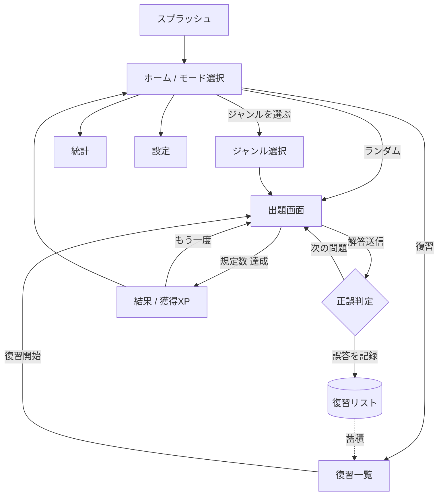
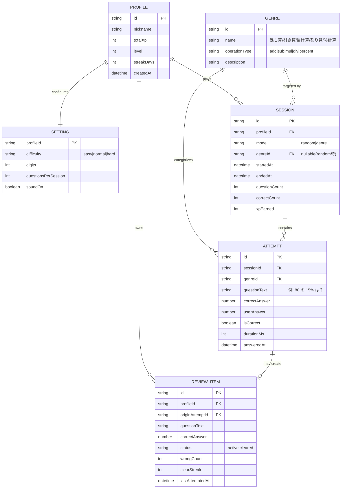
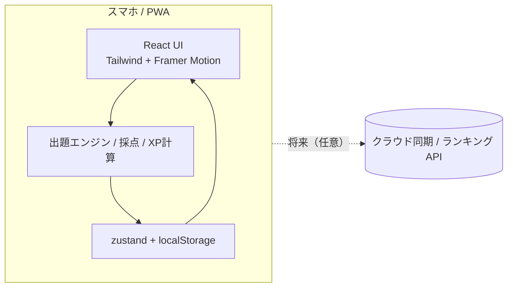

# めざせ、計算マスター！ ― 設計書一式

## 0. プロダクト概要

「めざせ、計算マスター！」は、通勤などの**隙間時間にスマホを開けば即座に計算ドリルを始められる**モバイルファーストの学習アプリです。やさしい四則演算から、買い物や仕事で使う「％計算（割引・マージン）」までを、電卓に頼らず**正確かつ素早く**解ける状態を目指します。

出題は「**ランダム**」と「**ジャンルを選ぶ**」の2モード。解答後すぐに正誤がわかり、間違えた問題は自動的に**復習リスト**に蓄積されて解き直せます。さらに**経験値・レベル**と楽しいアニメーションで、苦手意識のある人が「続けたくなる」体験を提供し、自信を持って数字に向き合えるようにします。

---

## 1. 要件定義書

### 1.1 背景・解決する課題
四則演算でつまずく・計算に時間がかかる人が、基礎から自力で計算できる状態に到達できずにいる。計算が苦手だと会議や買い物で数字がぱっと出ず、自信を持てない・判断が遅れる。**避け続けるのではなく、基礎から少しずつ鍛える**ことで日常・仕事の数字に落ち着いて対応できるようにする。

### 1.2 目的・ゴール
- 隙間時間にスマホで**即始められる**計算練習の習慣化。
- やさしい四則演算 → 割引・マージンの**％計算**までを、電卓なしで正確・素早く解けるようにする。
- 間違いを**繰り返し克服**でき、努力が**目に見える**（モチベーション維持）。

### 1.3 機能要件
| 機能名 | 概要 | 優先度 |
|---|---|---|
| 出題エンジン | 四則演算・％計算の問題をランダムな数値で自動生成（例: 10の倍数を使った％計算） | Must |
| ランダムモード | 全ジャンルから無作為に連続出題 | Must |
| ジャンル選択モード | 足し算/引き算/掛け算/割り算/％計算を選んで集中練習 | Must |
| 解答入力・即時採点 | テンキー入力 → 送信で即座に正誤判定・正答表示 | Must |
| セッション結果 | 正答数・正答率・解答時間・獲得XPのサマリー | Must |
| 復習機能 | 誤答を自動記録し、復習モードで解き直し。連続正解で卒業 | Must |
| 経験値・レベル | 正解・連続正解・速解でXP付与、レベルアップ演出 | Should |
| アニメーション演出 | 正解/不正解/レベルアップのマイクロインタラクション | Should |
| 学習統計 | ジャンル別の正答率・平均解答時間・継続日数（ストリーク） | Should |
| 設定 | 難易度（桁数・小数有無）、1セッションの問題数、サウンドON/OFF | Should |
| オンボーディング | 初回の簡単な遊び方説明 | Could |

### 1.4 非機能要件
- **性能**: 起動〜出題まで体感即時（目標 < 1s）、採点フィードバックは **< 100ms**。出題生成は端末内で完結。
- **ユーザビリティ／視認性**: スマホ最適化・**片手/親指操作**前提。数字は大きく高コントラスト、タップ領域 ≥ 44px。
- **可用性**: **オフライン動作（PWA）**。データは端末に保存し、通信不要で練習可能。
- **セキュリティ／プライバシー**: 個人情報を扱わない。データはローカル保存で外部送信なし（MVP）。
- **拡張性**: ジャンル・難易度を**パラメータ／プラグイン的に追加**できる出題設計。
- **アクセシビリティ**: 文字サイズ拡大対応、**色だけに依存しない正誤表示**（アイコン併用）。

---

## 2. 画面設計・画面遷移図

### 2.1 主要画面一覧
| 画面 | 役割 |
|---|---|
| スプラッシュ | 起動。最短でホームへ |
| ホーム / モード選択 | 「ランダム」「ジャンルを選ぶ」「復習」への入口、XP/レベル表示 |
| ジャンル選択 | 足し算〜％計算からジャンルを選ぶ |
| 出題画面 | 問題提示・テンキー入力・進捗・残り問題数 |
| 即時フィードバック | 正誤・正答・獲得XPを瞬時表示（出題画面にオーバーレイ） |
| 結果 | セッションの正答率・時間・XP・レベルアップ |
| 復習一覧 | 誤答リスト。まとめて/個別に復習開始 |
| 統計 | ジャンル別成績・ストリーク |
| 設定 | 難易度・問題数・サウンド |

### 2.2 画面遷移図

---

## 3. デザイン設計書

### 3.1 デザイン原則
1. **ゼロ摩擦で即スタート** — ホームから**1タップで出題開始**。広告や前置きで手を止めない（迅速なUX）。
2. **数字ファースト・高視認性** — 問題の数字を画面の主役にし、大きく・高コントラストで。入力テンキーは親指の届く下部に固定（スマホ視認性）。
3. **楽しい手応え** — 正解/不正解/レベルアップを**マイクロアニメーション**で即時に返し、解くこと自体を気持ちよく（楽しいアニメーション）。
4. **努力が見える** — XP・レベル・連続正解（コンボ）・ストリークを常に可視化し、達成感で継続を促す（ゲーミフィケーション）。
5. **集中を妨げない** — 出題中はUIを最小化し、1問＝1フォーカス。

### 3.2 デザインシステム

**カラーパレット**
| 役割 | 名称 | HEX | 用途 |
|---|---|---|---|
| Background | Cloud White | `#F8FAFC` | 画面背景 |
| Surface | Snow | `#FFFFFF` | カード・問題面 |
| Primary | Focus Blue | `#2563EB` | 主要ボタン・選択中・進捗 |
| Accent (XP) | Level Gold | `#F59E0B` | 経験値・レベル・報酬演出 |
| Success | Fresh Green | `#16A34A` | 正解フィードバック |
| Error | Alert Red | `#DC2626` | 不正解・正答提示 |
| Text | Ink | `#0F172A` | 本文・数字 |
| Muted | Slate | `#64748B` | 補助テキスト・プレースホルダ |

**タイポグラフィ**
| 役割 | フォント | 用途 |
|---|---|---|
| Display / 数字 | Poppins（数字は tabular-nums）/ Noto Sans JP | 問題の数式・大見出し（桁ズレ防止に等幅数字） |
| Body | Inter / Noto Sans JP | 本文・ラベル・ボタン |

**余白・グリッド / 角丸**
- 4px ベースのスペーシング（4 / 8 / 12 / 16 / 24 / 32）。
- 角丸: 入力・ボタン `8px`、カード `16px`、XP/進捗バー・ピル `full(9999px)`。
- レイアウト: 上=問題、中=回答状況、下=テンキーの**3レーン固定**（親指操作）。

**主要 UI コンポーネント**
- **モードカード**（ランダム/ジャンル/復習の大きな選択肢）
- **問題カード**（数式を大きく表示）
- **テンキー**（0–9・クリア・送信、下部固定）
- **回答送信ボタン**（Primary、押下アニメ）
- **進捗バー**（残り問題数）/ **コンボ表示**
- **XP・レベルバー**（Gold、レベルアップ時に演出）
- **フィードバック演出**（正解＝緑チェック＋スケールアニメ、不正解＝赤＋正答カード。アイコン併用で色覚に配慮）
- **結果サマリーカード**（正答率・時間・XP）

---

## 4. データモデル設計

> 補足: 出題された問題そのものは原則**生成ロジック**で都度作るためテーブル化不要。誤答時のみ `REVIEW_ITEM` にスナップショットを保存し、復習で再現する。MVPは単一プロファイル（ローカル）で開始し、将来の複数端末同期に備えて `profileId` を持たせておく。

---

## 5. システム・技術構成

### 5.1 推奨技術スタックと選定理由
| 領域 | 採用 | 理由 |
|---|---|---|
| 形態 | **PWA（インストール可・オフライン対応）** | 「開いてすぐ」「隙間時間」「通信不要」を満たす。ストア審査なしで配布も容易 |
| フレームワーク | Next.js（App Router）+ React + TypeScript | 既存資産を活かせ、静的書き出しでデスクトップ/モバイル両対応 |
| スタイル | Tailwind CSS | デザインシステム（余白4px基調・トークン）を一貫実装しやすい |
| 状態・永続化 | zustand + localStorage（将来 IndexedDB） | 端末内完結・オフライン・プライバシー良好 |
| アニメーション | Framer Motion | 正誤/レベルアップのマイクロインタラクションを軽量に実装 |
| 出題ロジック | クライアント内の純粋関数 | サーバー不要・即時・拡張容易（ジャンル追加が関数追加で済む） |
| バックエンド | MVPは無し（将来: 同期/ランキング用に軽量API） | 個人情報を扱わずローカル完結。必要時のみ後付け |

### 5.2 全体構成

---

## 6. リスク・留意点 と 次のアクション

### 6.1 リスク・留意点
- **数字入力UX**: 自由入力（テンキー）か選択式かで難易度・速度感が変わる。％計算は選択式併用も検討。
- **出題難易度の設計**: ％計算は「10の倍数」など解きやすい数から段階的に。簡単すぎ/難しすぎを避ける適応的難易度を要設計。
- **モチベーション設計のバランス**: XP/レベルが作業感にならないよう、達成のテンポと報酬の重みを調整。
- **データ消失**: ローカル保存のみのため、ブラウザデータ削除で進捗が消える。エクスポート/将来のクラウド同期で緩和。
- **アクセシビリティ**: 正誤は色だけに頼らずアイコン・文言を併用。
- **継続率**: ストリークやリマインド（通知はPWA権限）で習慣化を支援。

### 6.2 次のアクション
1. 本設計を**機能 → ストーリー**へ分解（出題エンジン / 採点 / 復習 / XP を優先）。
2. 出題アルゴリズム（ジャンル別の数値レンジ・難易度パラメータ）の仕様確定。
3. デザインシステムの確定（カラー/タイポのトークン化）とコアコンポーネント試作。
4. 「ホーム→出題→即フィードバック→結果」の縦切りプロトタイプで体感検証。

### 整合性チェック（課題・理想・デザイン方針との対応）
- **即始められる**（理想）→ 原則①／スプラッシュ最短遷移／PWA即起動。
- **2モード・ジャンル別**（理想）→ 機能要件・遷移図に反映。
- **即時正誤＋復習**（理想/必要なもの）→ ATTEMPT・REVIEW_ITEM・復習フロー。
- **やさしい四則〜％計算**（課題）→ GENRE の operationType と難易度パラメータ。
- **迅速UX/視認性/楽しさ/ゲーミフィケーション**（デザイン方針）→ デザイン原則①〜④とコンポーネント群。
